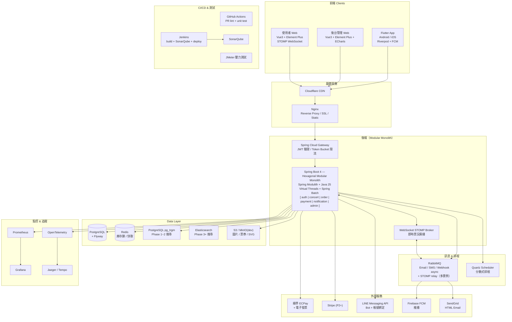

# 01 — 技術選型

> [← 返回總覽](../PROJECT_PLAN.md)

---

## 後端核心

| 項目 | 選用 | 備註 |
|---|---|---|
| 語言 | Java 25 | Virtual Threads (Project Loom)，高 I/O 並發 |
| 框架 | Spring Boot 4.x | Spring Security / Spring Data JPA / Spring Batch |
| 模組化 | Spring Modulith | 強制 Modular Monolith 邊界，支援漸進式拆分 |
| 架構風格 | Hexagonal Architecture | Ports & Adapters，domain 層零框架依賴 |
| 建構工具 | Gradle (Groovy DSL) | |
| API | REST + Spring WebSocket (STOMP) | REST 主要 API；WebSocket 即時票況廣播 |
| API 版本 | `/api/v1/...` | 從一開始就版本化，保護 App 舊版相容性 |

## 資料層

| 項目 | 選用 | 備註 |
|---|---|---|
| 資料庫 | PostgreSQL 16 | 各模組獨立 Schema，Flyway 管理版本 |
| 快取 / 分散鎖 | Redis 7+ | 庫存扣減、分散式鎖、Session |
| 搜尋（Phase 1~2）| PostgreSQL `pg_trgm` | `ILIKE` + GIN index 加速，無需安裝額外套件；預留 `SearchService` interface，未來可升級至 `zhparser` FTS（中文斷詞）或 Elasticsearch |
| 搜尋（Phase 3+）| Elasticsearch | 複雜 Faceted Search，切換時只改 infrastructure 層 |
| 物件儲存 | AWS S3 / MinIO（dev）| 圖片、票券 PDF、座位圖 SVG |

## 訊息 & 排程

| 項目 | 選用 | 備註 |
|---|---|---|
| 訊息佇列（Phase 1）| RabbitMQ | Email queue / SMS / Webhook async / STOMP relay |
| 訊息佇列（Phase 2+）| Kafka | 拆 Microservices 後跨服務事件串流 |
| 排程（簡單）| `@Scheduled` | 單實例可用 |
| 排程（分散式）| Quartz Scheduler | 多實例部署時確保同一 Job 只跑一次 |
| 背景批次 | Spring Batch | 財報、報表匯出、失敗交易處理、票券釋放 |

## 後端開發套件

| 套件 | 用途 |
|---|---|
| Flyway | DB Migration 版本管理 |
| Lombok | 減少 Java 樣板代碼（@Getter、@Builder 等）|
| MapStruct | 編譯期 Entity ↔ DTO 轉換，效能佳 |
| springdoc-openapi | 自動產生 Swagger UI / OpenAPI 3.0 文件 |
| Spring Modulith | 模組邊界強制驗證與模組整合測試 |
| Resilience4j | Circuit Breaker，保護對外呼叫（金流 API）|
| Testcontainers | 整合測試用真實 Docker 容器（PG / Redis）|
| JJWT | JWT 產生與驗證 |
| Thymeleaf | HTML Email 模板引擎 |
| Micrometer + Actuator | 暴露 metrics 給 Prometheus |
| OpenTelemetry | 分散式追蹤標準（不綁定特定後端）|
| line-bot-spring-boot | LINE Messaging API SDK |

## 代碼品質（後端）

| 工具 | 用途 | 使用方式 |
|---|---|---|
| **SonarQube** | 靜態代碼分析，找出 Bug / Security / Code Smell | Docker 啟動 Server，IntelliJ SonarLint 連接 |
| **SonarLint**（IntelliJ 外掛）| 即時本機分析，不需 Server | 安裝外掛即用，支援離線 |
| JUnit 5 + Mockito | 單元測試 | `./gradlew test` |
| Testcontainers | 整合測試 | `./gradlew integrationTest` |

---

## 前端（使用者 Web）

| 項目 | 選用 |
|---|---|
| 框架 | Vue 3 (Composition API) |
| UI Library | Element Plus |
| 狀態管理 | Pinia + Pinia Persist |
| HTTP | Axios（Token Refresh Interceptor）+ TanStack Query |
| WebSocket | `@stomp/stompjs` + `sockjs-client` |
| CSS | TailwindCSS v4 |
| 表單驗證 | VeeValidate + Zod |
| 工具 | VueUse、Day.js、vue-i18n |
| Build | Vite |

## 前端（後台管理 Web）

| 項目 | 選用 |
|---|---|
| 框架 | Vue 3 + Element Plus |
| 圖表 | Apache ECharts |
| 座位圖編輯 | Fabric.js（熱區標記）|
| 其他 | 同使用者前台 |

## 代碼品質（前端）

| 工具 | 用途 | 使用方式 |
|---|---|---|
| **ESLint** | JavaScript / TypeScript 語法與風格檢查 | `npm run lint` / VS Code 即時顯示 |
| **Prettier** | 代碼格式化 | `npm run format` / 存檔自動格式化 |
| **TypeScript** | 型別安全 | 編譯期型別檢查 |
| Vitest | 單元測試 | `npm run test` |

---

## Flutter App

| 套件 | 用途 |
|---|---|
| flutter_riverpod | 狀態管理 |
| dio | HTTP Client（含 Token Refresh Interceptor）|
| go_router | Navigation |
| flutter_secure_storage | 安全儲存 JWT Token（Keychain / Keystore）|
| qr_flutter | 動態 HMAC QR Code 顯示（含倒數刷新）|
| mobile_scanner | QR Code 掃描（Staff 驗票模式）|
| firebase_messaging | FCM 推播通知 |
| local_auth | 生物辨識登入（Face ID / Touch ID）|
| stomp_dart_client | WebSocket STOMP（即時票況）|

---

## 金流（按開發優先順序）

| 優先 | 服務商 | 市場 | 支援付款方式 |
|---|---|---|---|
| P1 | 綠界科技 ECPay | 台灣 | 信用卡、ATM、超商代碼 + **電子發票 API** |
| P1 | 藍新金流 NewebPay | 台灣 | 信用卡、LINE Pay、街口支付 |
| P2 | Stripe | 全球 | 信用卡、Apple Pay、Google Pay |
| P3 | PayPal | 全球補充 | 電子錢包 |

---

## 外部服務

| 服務 | 用途 |
|---|---|
| **LINE Messaging API** | LINE Bot 推播、票券發送、帳號綁定 |
| **Firebase FCM** | Flutter App 推播通知 |
| **SendGrid / AWS SES** | HTML Email 發送（含 Thymeleaf 模板）|

> ⚠️ **LINE Notify 已於 2025/03/31 停止服務**，請勿使用。

---

## CI/CD & 測試

| 工具 | 用途 |
|---|---|
| **GitHub Actions** | PR 快速反饋：lint + unit test（幾分鐘內）|
| **Jenkins**（自架）| 完整 pipeline：build + 整合測試 + SonarQube + 部署 |
| **SonarQube** | Code Quality 掃描（Jenkins 整合）|
| **JMeter** | 壓力測試（搶票峰值模擬、長時間耐久測試）|
| Testcontainers | 整合測試（真實 DB / Redis）|

---

## 基礎設施

| 項目 | 選用 | 備註 |
|---|---|---|
| **Nginx** | Reverse Proxy + 靜態檔案服務 + SSL 終止 + Load Balance | 必用 |
| Docker + Docker Compose | 本機開發環境 | 所有依賴服務容器化 |
| Kubernetes / K3s | 正式環境容器編排（未來）| |
| Cloudflare | CDN + DDoS 防護 | |
| Prometheus + Grafana | 監控 | |
| Jaeger / Tempo | 分散式追蹤（OpenTelemetry 後端）| |
| HashiCorp Vault | Secret 管理（正式環境，Phase 2+）| |

---

## 完整 Tech Stack 圖

