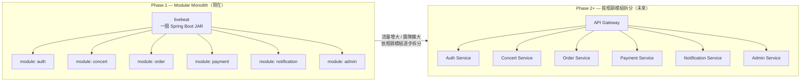
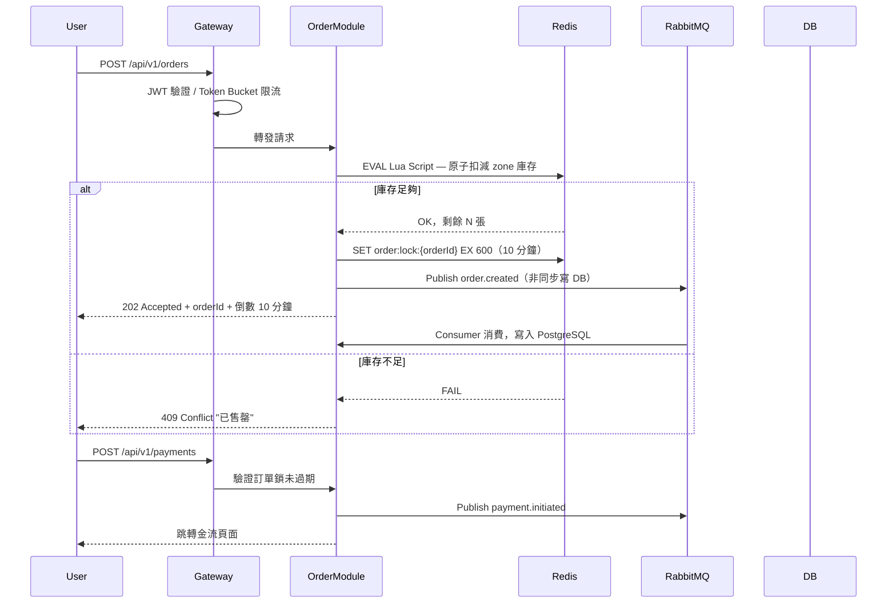

# 02 — 系統架構

> [← 返回總覽](../PROJECT_PLAN.md)

---

## 目錄

1. [架構策略：Hexagonal Modular Monolith](#一架構策略hexagonal-modular-monolith)
2. [模組結構與邊界規則](#二模組結構與邊界規則)
3. [Monolith → Microservices 拆分路徑](#三monolith--microservices-拆分路徑)
4. [高並發設計（搶票核心）](#四高並發設計搶票核心)
5. [程式碼檔案註解規範](#五程式碼檔案註解規範)

---

## 一、架構策略：Hexagonal Modular Monolith

### 為什麼選 Modular Monolith

- 需求仍在確立中，模組邊界還在摸索，單一 codebase 容易調整
- 開發速度快、除錯容易、部署簡單（一個 JAR）
- 轉換到 Microservices 的成本來源是「**邊界沒畫清**」，不是「用了 Monolith」
- 使用 **Spring Modulith** 強制驗證模組邊界，確保未來拆分時成本最低

### Hexagonal Architecture（六邊形架構）

每個模組內部遵循 Ports & Adapters 四層結構，**domain 層完全不依賴任何框架**：

```
concert/
├── api/                          ← Adapter In（輸入端）
│   ├── ConcertController.java    ← 接收 HTTP 請求
│   └── dto/                      ← Request / Response DTO
│
├── application/                  ← Use Case（業務邏輯編排）
│   ├── ConcertService.java       ← 只依賴 domain interfaces，不依賴框架
│   └── dto/                      ← Application-level DTO
│
├── domain/                       ← 核心（純 Java，零框架依賴）
│   ├── Concert.java              ← Domain Entity
│   ├── ConcertSession.java
│   └── ConcertRepository.java   ← Port（interface，由 infrastructure 實作）
│
└── infrastructure/               ← Adapter Out（輸出端）
    ├── ConcertJpaRepository.java ← JPA 實作 ConcertRepository
    ├── ConcertSearchAdapter.java ← Phase1: PG FTS；Phase3+: ES，切換只改這裡
    └── entity/                   ← JPA Entity（與 domain Entity 分開）
```

**換 DB（如 PostgreSQL → MongoDB）：**
只改 `infrastructure/`，`domain/` 和 `application/` 完全不動。

**換搜尋引擎（PG FTS → Elasticsearch）：**
`SearchService` interface 定義在 `application/`，只需換掉 `infrastructure/` 的實作並更改 Spring `@Bean`，上層邏輯不動。

---

## 二、模組結構與邊界規則

### 六個模組

| 模組 | 職責 |
|---|---|
| `auth` | 使用者註冊、登入、JWT、OAuth2（Google / Apple）、LINE 帳號綁定 |
| `concert` | 演唱會 CRUD、場次管理、票區設定、座位圖、WebSocket 票況廣播 |
| `order` | 訂單建立（含 Redis 庫存鎖）、訂單狀態管理、座位鎖定 |
| `payment` | 金流串接（ECPay / NewebPay / Stripe）、電子發票、退款 |
| `notification` | Email（Thymeleaf HTML）、LINE Bot 推播、FCM 推播 |
| `admin` | 統計報表、Spring Batch Job 定義、驗票、使用者管理 |
| `shared` | 共用 Exception / Config / Security / WebSocket Config |

### 模組邊界規則

```
✅ 允許：
  order module    → 呼叫 concert module 的 public application interface（查詢場次 / 票區）
  notification    → 監聽 order / payment module 發出的 Spring ApplicationEvent
  admin module    → 呼叫各 module 的 read-only query interface

❌ 嚴格禁止：
  跨 module 直接呼叫 @Repository（Repository 為 package-private）
  跨 module 直接 JOIN 資料表
  循環依賴（A 依賴 B，B 又依賴 A）
```

每個 module 對外只暴露 `public` 的 Service Interface，內部 Repository / Infrastructure 均為 `package-private`。  
Spring Modulith 會在整合測試時**自動驗證**這些邊界是否被破壞。

### DB Schema 分離

雖然 Phase 1 共用同一個 PostgreSQL instance，每個模組使用**獨立的 DB Schema**：

```
PostgreSQL
├── schema: auth       ← user, line_binding
├── schema: concert    ← concert, concert_session, ticket_zone, seat, seat_map, zone_hotspot
├── schema: order      ← order, order_item, ticket
├── schema: payment    ← payment, electronic_invoice
└── schema: admin      ← (主要讀取其他 schema，或有獨立的 report_cache 等)
```

未來拆成 Microservices 時，每個 schema 直接對應到獨立的 DB instance。

---

## 三、Monolith → Microservices 拆分路徑



**拆分時的工作量（每個模組）：**
1. 把 module package 搬至獨立 repo
2. 給該模組獨立的 DB instance（schema 已分離，直接掛上去）
3. Spring `ApplicationEvent` → Kafka topic
4. Interface 呼叫 → OpenFeign / gRPC

---

## 四、高並發設計（搶票核心）

### 訂票流程



### 關鍵策略

| 策略 | 說明 |
|---|---|
| **Redis Lua 原子扣減** | 庫存在 Redis 管理，Lua script 保證原子性，防超賣 |
| **訂單鎖 TTL 10 分鐘** | 未付款自動釋放庫存，避免票券被長期佔用 |
| **RabbitMQ 削峰** | 下單後非同步寫 DB，DB 不直接承受搶票瞬間流量 |
| **Token Bucket 限流** | 每個 IP / User 限流，防刷票機器人 |
| **多級快取** | CDN → Redis → DB，演唱會資訊讀取幾乎不打 DB |
| **Virtual Threads** | Java 25 Loom，高 I/O 並發不需龐大 Thread Pool |
| **Virtual Waiting Room** | 高需求演唱會排隊室，Phase 4 實作 |

---

## 五、程式碼檔案註解規範

> 每個檔案（Java class、Vue 頁面、Vue 元件、TypeScript 工具）最上方必須有頂部註解。  
> 說明這個檔案的職責，讓開發者不需要讀完整個檔案就能快速定位。  
> **若檔案職責在開發過程中改變，必須同步更新頂部註解。**

---

### Java（Class / Interface）

使用 Javadoc 格式（`/** */`）：

```java
/**
 * [模組名稱] 類別功能簡述
 *
 * 負責：具體職責說明
 * 對應路由（Controller 適用）：HTTP Method /api/v1/xxx
 * 依賴：主要依賴的 Service 或 Repository
 */
```

**範例 — Controller：**
```java
/**
 * [concert] 演唱會 REST API 控制器
 *
 * 負責：演唱會與場次的查詢、新增、更新、上下架操作
 * 對應路由：GET /api/v1/concerts, POST /api/v1/admin/concerts
 * 依賴：ConcertService
 */
@RestController
@RequestMapping("/api/v1/concerts")
public class ConcertController { ... }
```

**範例 — Service：**
```java
/**
 * [order] 訂單業務邏輯服務
 *
 * 負責：建立訂單、Redis 庫存扣減、訂單狀態流轉
 * 依賴：OrderRepository, TicketZoneRepository, RedisTemplate
 */
@Service
public class OrderService { ... }
```

**範例 — Repository Interface（domain 層）：**
```java
/**
 * [concert] 演唱會資料存取介面（Port）
 *
 * 負責：定義演唱會資料的存取契約，由 infrastructure 層實作
 */
public interface ConcertRepository { ... }
```

---

### Vue — Page（頁面，對應路由）

使用 HTML 註解（`<!-- -->`），放在 `<script setup>` 之前：

```vue
<!--
  [模組名稱] 頁面功能簡述
  負責：這個頁面做什麼
  路由：/對應的路由路徑
  使用：主要使用的 composable、store、子元件
-->
```

**範例：**
```vue
<!--
  [concert] 演唱會詳情頁
  負責：顯示演唱會資訊、場次列表選擇、票區選擇，並透過 WebSocket 即時更新票況
  路由：/concerts/:id
  使用：useConcertDetail, useWebSocket, ConcertSessionSelector, ZoneSelector, BookingModal
-->
<script setup lang="ts">
...
</script>
```

---

### Vue — Component（可複用元件）

```vue
<!--
  [模組名稱] 元件功能簡述
  負責：這個元件的職責
  使用於：哪些 Page 或 Component 使用此元件
  Props：主要 props 簡述（選填，複雜元件才需要）
-->
```

**範例：**
```vue
<!--
  [concert] 票區選擇元件
  負責：顯示各票區剩餘票數、售罄狀態，觸發使用者選取票區的事件
  使用於：ConcertDetailPage
  Props：concert（演唱會資料）、selectedZone（已選票區）
-->
<script setup lang="ts">
...
</script>
```

---

### TypeScript（API 封裝 / Store / Composable / 工具）

使用 JSDoc 格式（`/** */`）：

```typescript
/**
 * [模組名稱] 功能簡述
 * 負責：這個檔案的具體職責
 */
```

**範例 — API 封裝：**
```typescript
/**
 * [concert] 演唱會 API 封裝
 * 負責：封裝所有演唱會相關 HTTP 請求，整合 TanStack Query 快取策略
 */
```

**範例 — Pinia Store：**
```typescript
/**
 * [auth] 使用者認證狀態管理
 * 負責：儲存登入狀態、JWT Token、使用者資訊，處理 Token 自動刷新
 */
```

**範例 — Composable：**
```typescript
/**
 * [concert] WebSocket 即時票況 Composable
 * 負責：建立 STOMP 連線，訂閱演唱會票況更新並提供響應式資料
 */
```

---

### Dart（Flutter）

使用 `///` 文件註解（Dart 標準）：

```dart
/// [模組名稱] 功能簡述
///
/// 負責：這個 class / widget 的職責
/// 使用於：哪個 Screen 或 Widget（元件適用）
```

**範例 — Screen（頁面）：**
```dart
/// [ticket] 我的票券頁面
///
/// 負責：顯示使用者所有票券列表，提供搜尋功能，點擊進入票券詳情
```

**範例 — Widget（元件）：**
```dart
/// [ticket] 票券卡片元件
///
/// 負責：顯示單張票券摘要資訊（演唱會名稱、場次、票區、狀態）
/// 使用於：MyTicketsScreen
```
