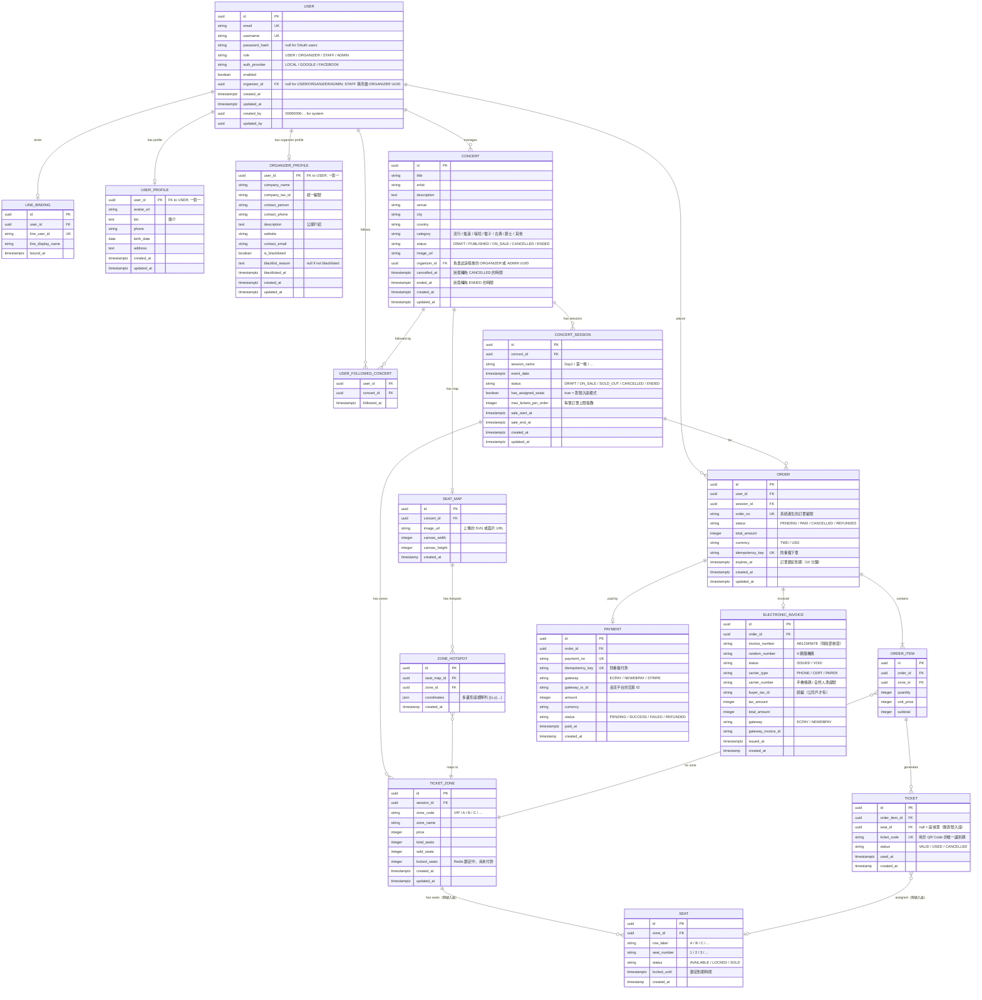

# 03 — 資料模型

> [← 返回總覽](../PROJECT_PLAN.md)

---

## 目錄

1. [技術備註](#技術備註)
2. [ERD 圖](#erd-圖)
3. [資料表說明](#資料表說明)

---

## 技術備註

| 項目 | 規範 | 說明 |
|---|---|---|
| ID 型別 | UUID | 全專案統一使用 UUID（`gen_random_uuid()`）。JPA 層使用 `GenerationType.UUID`，由 Hibernate 在 Java 側產生 |
| 時間戳 | `TIMESTAMPTZ` / `Instant` | 所有時間欄位一律使用 PostgreSQL `TIMESTAMPTZ`（含時區），Java 層對應 `Instant`（UTC），支援全球多時區 |
| 搜尋索引 | PostgreSQL `pg_trgm` | 啟用 GIN index 加速中文關鍵字搜尋（藝人名、場館、標題）。若未來需要中文斷詞，可升級至 `zhparser` 文字搜尋設定 |
| Audit 欄位 | Spring Data JPA Auditing | 共用三層 `@MappedSuperclass`：`CreatedEntity`（created_at）、`TimestampedEntity`（+ updated_at）、`AuditedEntity`（+ created_by、updated_by）。`created_by` / `updated_by` 存 UUID，系統操作填全零 UUID（`00000000-...`） |
| DB 說明 | 雙語 Comment | 所有 table 與 column 均加 `COMMENT ON`，格式為 `English \| 繁體中文` |
| 帳號架構 | 核心身份 + Profile 延伸 | `auth.users` 僅存認證核心欄位（email、role、password_hash）；各角色延伸資料獨立成 profile 表（`auth.user_profiles`、`auth.organizer_profiles`），避免 nullable 欄位膨脹；ADMIN / STAFF 無需 profile 表 |

---

## ERD 圖

---

## 資料表說明

### `USER`（使用者）

| 欄位 | 說明 |
|---|---|
| `username` | 顯示名稱，可由使用者修改（修改後 `updated_by` 記錄操作者）|
| `role` | `USER`：一般購票用戶；`ORGANIZER`：主辦方（可管理自己的演唱會、場次、票區、查報表）；`STAFF`：驗票工作人員（只能驗票）；`ADMIN`：系統管理員（可退款、管理帳號）|
| `auth_provider` | `LOCAL`：Email 密碼登入；`GOOGLE` / `FACEBOOK`：OAuth 登入 |
| `password_hash` | OAuth 登入用戶為 `null` |
| `enabled` | 帳號是否啟用，管理員可停用異常帳號 |
| `organizer_id` | 僅 `STAFF` 使用；指向管理此工作人員的 ORGANIZER UUID；其他角色為 `null`。ORGANIZER 帳號刪除時自動設為 `null`（`ON DELETE SET NULL`）|
| `created_by` | 系統建立（如自行註冊）時為全零 UUID（`00000000-...`）|
| `updated_by` | 使用者自行修改資料時為自身 UUID；管理員操作時為管理員 UUID |

---

### `LINE_BINDING`（LINE 帳號綁定）

| 欄位 | 說明 |
|---|---|
| `line_user_id` | LINE 平台的使用者唯一 ID（`U` 開頭的字串）|
| `line_display_name` | LINE 顯示名稱，綁定時儲存 |

---

### `USER_PROFILE`（使用者個人資料）

> 所有角色均可使用。`auth.users` 只存認證核心欄位，此表存放使用者的個人延伸資料。

| 欄位 | 說明 |
|---|---|
| `user_id` | 同時作為 PK 與 FK，與 `auth.users.id` 一對一對應 |
| `avatar_url` | 大頭貼圖片 URL（存於 MinIO / S3）|
| `bio` | 個人簡介（自我介紹文字）|
| `phone` | 聯絡電話 |
| `birth_date` | 生日（可用於年齡限制驗證）|
| `address` | 居住地址（票券郵寄用途，選填）|

---

### `ORGANIZER_PROFILE`（主辦方延伸資料）

> 僅 `ORGANIZER` 角色使用。存放主辦方的公司資訊與黑名單狀態。

| 欄位 | 說明 |
|---|---|
| `user_id` | 同時作為 PK 與 FK，與 `auth.users.id` 一對一對應 |
| `company_name` | 主辦公司名稱 |
| `company_tax_id` | 統一編號（用於電子發票開立）|
| `contact_person` | 主要聯絡人姓名 |
| `contact_phone` | 聯絡電話 |
| `description` | 主辦方公開介紹，顯示於前台頁面 |
| `website` | 官方網站 URL |
| `contact_email` | 公開聯絡信箱 |
| `is_blacklisted` | 是否列入黑名單（黑名單主辦方無法新增演唱會）|
| `blacklist_reason` | 黑名單原因（`is_blacklisted = true` 時填入）|
| `blacklisted_at` | 列入黑名單的時間 |

---

### `USER_FOLLOWED_CONCERT`（追蹤演唱會）

> USER 與 CONCERT 的多對多橋接表。複合主鍵 `(user_id, concert_id)`，同一使用者不可重複追蹤同一演唱會。

---

### `CONCERT`（演唱會）

| 欄位 | 說明 |
|---|---|
| `organizer_id` | 負責此演唱會的使用者 UUID；目前由 ADMIN 建立時填入 ADMIN 自身 UUID，未來 ORGANIZER 自建時填入其 UUID；資料隔離依據：ORGANIZER 只能操作 `organizer_id = 自身 UUID` 的演唱會 |
| `status` | `DRAFT`：草稿（未公開，僅後台可見）；`PUBLISHED`：已公告（使用者可瀏覽、追蹤，尚未開賣）；`ON_SALE`：開賣中；`CANCELLED`：取消；`ENDED`：已結束 |
| `cancelled_at` | 狀態轉為 CANCELLED 的時間戳，用於計算公開可見期限（14 天後前台隱藏）|
| `ended_at` | 狀態轉為 ENDED 的時間戳，用於計算公開可見期限（14 天後前台隱藏）|
| `category` | 音樂類型，用於前台篩選 |

---

### `CONCERT_SESSION`（演唱會場次）

同一個演唱會可有多個場次（例如連演兩天）。

| 欄位 | 說明 |
|---|---|
| `has_assigned_seats` | `false`：區域票模式（只選票區 + 數量）；`true`：對號入座模式 |
| `max_tickets_per_order` | 每筆訂單最多可購買幾張，防止黃牛大量掃票 |
| `sale_start_at` | 開賣時間；前台可顯示倒數計時 |

---

### `TICKET_ZONE`（票區）

| 欄位 | 說明 |
|---|---|
| `sold_seats` | 已確定售出的票數（已付款）|
| `locked_seats` | Redis 中被訂單鎖定但尚未付款的票數；訂單過期後歸零 |
| 可售剩餘 | `total_seats - sold_seats - locked_seats`（Redis 中計算）|

---

### `SEAT`（座位，對號入座模式）

| 欄位 | 說明 |
|---|---|
| `status` | `AVAILABLE`：可選；`LOCKED`：被某張訂單暫時鎖定；`SOLD`：已售出 |
| `locked_until` | 鎖定到期時間，Spring Batch `SeatLockReleaseJob` 定期掃描並釋放 |

---

### `SEAT_MAP` + `ZONE_HOTSPOT`（SVG 座位圖，選配）

僅在後台上傳過 SVG 座位圖時使用。`coordinates` 為 JSON 格式的多邊形座標，前台使用 SVG pan-zoom 渲染，後台使用 Fabric.js 標記熱區。

---

### `ORDER`（訂單）

| 欄位 | 說明 |
|---|---|
| `order_no` | 對外顯示的訂單號（可讀性高，如 `ORD-20260501-0001`）|
| `status` | `PENDING`：待付款；`PAID`：已付款；`CANCELLED`：已取消；`REFUNDED`：已退款 |
| `idempotency_key` | 前端產生的唯一 key，防止網路重送造成重複建立訂單 |
| `expires_at` | 訂單建立後 10 分鐘，`OrderExpiryJob` 掃描並自動取消過期訂單 |

---

### `TICKET`（票券）

| 欄位 | 說明 |
|---|---|
| `ticket_code` | UUID，用於 QR Code 內容；配合 HMAC 簽名做動態 QR Code |
| `seat_id` | 對號入座時指向具體座位；區域票時為 `null` |
| `status` | `VALID`：有效；`USED`：已入場；`CANCELLED`：已取消 |

---

### `PAYMENT`（付款）

| 欄位 | 說明 |
|---|---|
| `gateway` | `ECPAY`：綠界；`NEWEBPAY`：藍新；`STRIPE`：Stripe |
| `gateway_tx_id` | 金流平台返回的交易流水號，用於對帳 |
| `idempotency_key` | 防止付款 API 重複呼叫造成重複扣款 |

---

### `ELECTRONIC_INVOICE`（台灣電子發票）

| 欄位 | 說明 |
|---|---|
| `invoice_number` | 財政部核發的發票號碼，格式為兩個英文字母 + 八位數字 |
| `carrier_type` | `PHONE`：手機條碼載具；`CERT`：自然人憑證；`PAPER`：紙本發票 |
| `buyer_tax_id` | 公司戶統一編號，個人購票時為 `null` |
