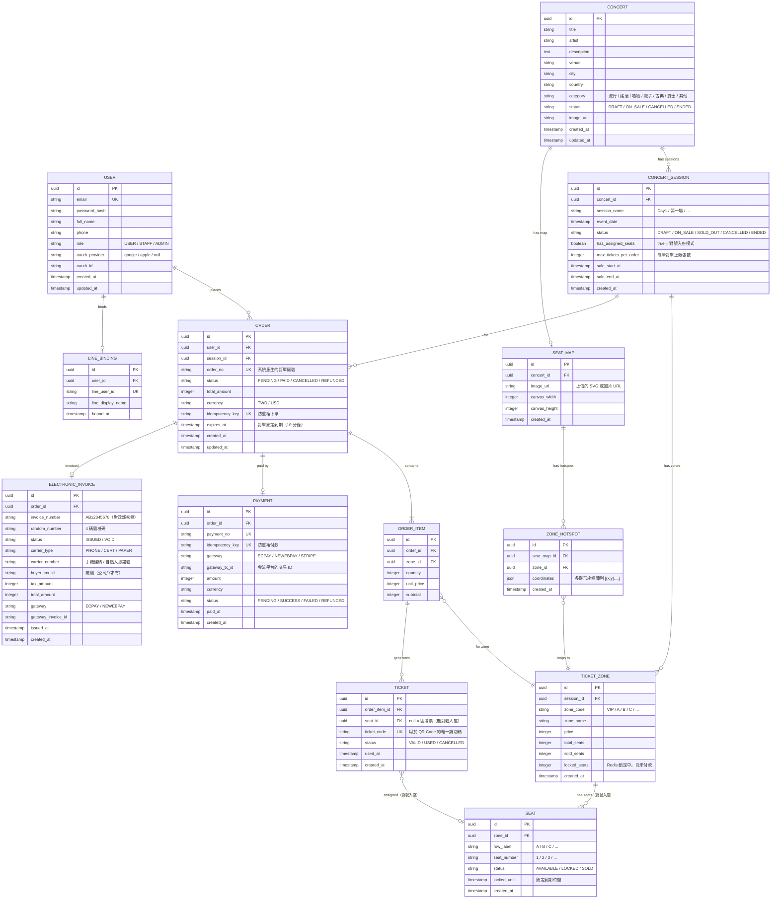

# 03 — 資料模型

> [← 返回總覽](../PROJECT_PLAN.md)

---

## ERD 圖

---

## 資料表說明

### `USER`（使用者）

| 欄位 | 說明 |
|---|---|
| `role` | `USER`：一般購票用戶；`STAFF`：票務公司員工（可管理演唱會、驗票）；`ADMIN`：系統管理員（可退款、管理帳號）|
| `oauth_provider` | Google / Apple OAuth 登入來源；純 Email 登入時為 `null` |
| `password_hash` | OAuth 登入用戶可為 `null` |

---

### `LINE_BINDING`（LINE 帳號綁定）

| 欄位 | 說明 |
|---|---|
| `line_user_id` | LINE 平台的使用者唯一 ID（`U` 開頭的字串）|
| `line_display_name` | LINE 顯示名稱，綁定時儲存 |

---

### `CONCERT`（演唱會）

| 欄位 | 說明 |
|---|---|
| `status` | `DRAFT`：草稿（未公開）；`ON_SALE`：開賣中；`CANCELLED`：取消；`ENDED`：已結束 |
| `category` | 音樂類型，用於前台篩選 |

---

### `CONCERT_SESSION`（演唱會場次）

同一個演唱會可有多個場次（例如連演兩天）。

| 欄位 | 說明 |
|---|---|
| `has_assigned_seats` | `false`：區域票模式（只選票區 + 數量）；`true`：對號入座模式 |
| `max_tickets_per_order` | 每筆訂單最多可購買幾張，防止黃牛大量掃票 |
| `sale_start_at` | 開賣時間；前台可顯示倒數計時 |

---

### `TICKET_ZONE`（票區）

| 欄位 | 說明 |
|---|---|
| `sold_seats` | 已確定售出的票數（已付款）|
| `locked_seats` | Redis 中被訂單鎖定但尚未付款的票數；訂單過期後歸零 |
| 可售剩餘 | `total_seats - sold_seats - locked_seats`（Redis 中計算）|

---

### `SEAT`（座位，對號入座模式）

| 欄位 | 說明 |
|---|---|
| `status` | `AVAILABLE`：可選；`LOCKED`：被某張訂單暫時鎖定；`SOLD`：已售出 |
| `locked_until` | 鎖定到期時間，Spring Batch `SeatLockReleaseJob` 定期掃描並釋放 |

---

### `SEAT_MAP` + `ZONE_HOTSPOT`（SVG 座位圖，選配）

僅在後台上傳過 SVG 座位圖時使用。`coordinates` 為 JSON 格式的多邊形座標，前台使用 SVG pan-zoom 渲染，後台使用 Fabric.js 標記熱區。

---

### `ORDER`（訂單）

| 欄位 | 說明 |
|---|---|
| `order_no` | 對外顯示的訂單號（可讀性高，如 `ORD-20260501-0001`）|
| `status` | `PENDING`：待付款；`PAID`：已付款；`CANCELLED`：已取消；`REFUNDED`：已退款 |
| `idempotency_key` | 前端產生的唯一 key，防止網路重送造成重複建立訂單 |
| `expires_at` | 訂單建立後 10 分鐘，`OrderExpiryJob` 掃描並自動取消過期訂單 |

---

### `TICKET`（票券）

| 欄位 | 說明 |
|---|---|
| `ticket_code` | UUID，用於 QR Code 內容；配合 HMAC 簽名做動態 QR Code |
| `seat_id` | 對號入座時指向具體座位；區域票時為 `null` |
| `status` | `VALID`：有效；`USED`：已入場；`CANCELLED`：已取消 |

---

### `PAYMENT`（付款）

| 欄位 | 說明 |
|---|---|
| `gateway` | `ECPAY`：綠界；`NEWEBPAY`：藍新；`STRIPE`：Stripe |
| `gateway_tx_id` | 金流平台返回的交易流水號，用於對帳 |
| `idempotency_key` | 防止付款 API 重複呼叫造成重複扣款 |

---

### `ELECTRONIC_INVOICE`（台灣電子發票）

| 欄位 | 說明 |
|---|---|
| `invoice_number` | 財政部核發的發票號碼，格式為兩個英文字母 + 八位數字 |
| `carrier_type` | `PHONE`：手機條碼載具；`CERT`：自然人憑證；`PAPER`：紙本發票 |
| `buyer_tax_id` | 公司戶統一編號，個人購票時為 `null` |
