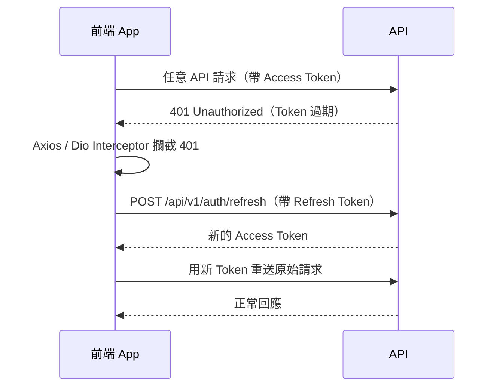
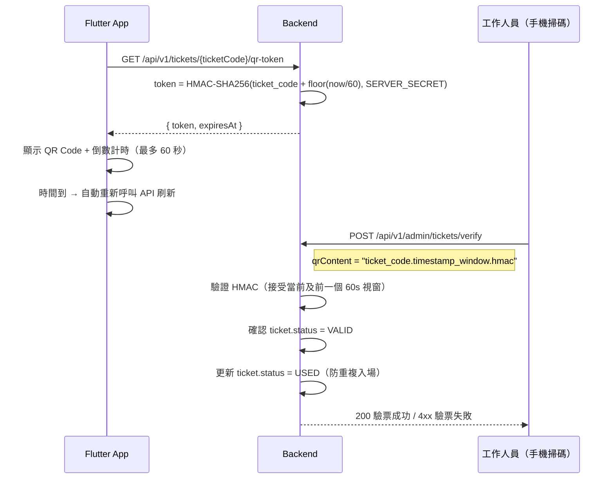

# 06 — 安全設計

> [← 返回總覽](../PROJECT_PLAN.md)

---

## 一、JWT 策略

### Token 規格

| Token | 有效期 | 儲存位置（Web）| 儲存位置（Flutter）|
|---|---|---|---|
| **Access Token** | 15 分鐘 | Memory（不存 localStorage）| flutter_secure_storage |
| **Refresh Token** | 30 天 | httpOnly + Secure Cookie | flutter_secure_storage |

> **為什麼 Access Token 不存 localStorage？**  
> localStorage 可被 JavaScript 讀取，若有 XSS 漏洞會造成 Token 被竊取。  
> 存在 Memory（Vue reactive state）搭配 httpOnly Cookie 的 Refresh Token，安全性更高。

### Token 自動刷新（無感換新）



使用者完全無感，不會被強制登出。

### Refresh Token Rotation

每次使用 Refresh Token 換新 Access Token 時，同時發放新的 Refresh Token，舊的立即失效。  
有效防止 Refresh Token 被竊取後長期使用。

---

## 二、OAuth2 登入

### 支援的 Provider

| Provider | 適用平台 | 備註 |
|---|---|---|
| **Google** | Web + Flutter App | |
| **Apple** | Flutter App（iOS）+ Web | App Store 規定：有其他第三方登入必須支援 Apple Sign In |

### 帳號關聯邏輯

```
用 Google 登入時：
1. 用 email 查 USER 表
2a. 找到 → 更新 oauth_provider / oauth_id，直接登入
2b. 找不到 → 自動建立新帳號（填入 Google 提供的 email / full_name）
```

> 同一個 Email 用不同方式登入（Email / Google / Apple）會關聯到同一個帳號。

---

## 三、動態 QR Code（HMAC 防截圖攻擊）

### 為什麼需要動態 QR Code

靜態 QR Code 的問題：截圖後轉發給他人，他人可以先進場，原持票人被擋在外面。

動態 HMAC 方案：QR Code 每 60 秒刷新，截圖超過 60 秒後即失效。

### 流程設計



### QR Code 格式

```
{ticket_code}.{timestamp_window}.{hmac_signature}

範例：
3f8a2b1c-uuid.28736400.a3f9b2c1d4e5f6a7b8c9d0e1f2a3b4c5
```

- `timestamp_window`：`floor(System.currentTimeMillis() / 1000 / 60)` — 每分鐘一個值
- `hmac_signature`：`HMAC-SHA256(ticket_code + "." + timestamp_window, SERVER_SECRET)`

### 防禦能力

| 攻擊方式 | 防禦機制 |
|---|---|
| 截圖轉發給他人 | 60 秒後 HMAC 失效 |
| 重複入場（同張票掃兩次）| 第一次掃描後 `status = USED`，第二次驗票失敗 |
| 偽造假 QR Code | 沒有 SERVER_SECRET 無法生成有效 HMAC |
| 抓包截取合法 Token | Token 有效期僅 60 秒，重用機率極低 |

---

## 四、API 安全

### Webhook 回調驗證

| 金流 | 驗證方式 |
|---|---|
| 綠界 ECPay | IP 白名單 + 自定義 CheckMacValue 簽名驗證 |
| 藍新 NewebPay | IP 白名單 + AES 加密驗證 |
| Stripe | Stripe-Signature Header + Webhook Secret 驗證 |
| LINE Messaging API | X-Line-Signature Header + Channel Secret HMAC 驗證 |

> Webhook endpoint 雖然是 Public（不需 JWT），但一律驗證來源簽名，防止偽造回調。

### Idempotency Key（防重複操作）

| 操作 | 說明 |
|---|---|
| **建立訂單** | 前端產生 UUID 作為 `idempotency_key`，同一個 key 只會建立一個訂單 |
| **發起付款** | 同樣機制，防止網路不穩重送造成重複扣款 |
| 實作方式 | 後端以 `idempotency_key` 為 UK 欄位，重複請求直接回傳原來的結果 |

### Token Bucket 限流（API Gateway）

| 層級 | 限制 |
|---|---|
| 每個 IP | 每秒最多 N 個請求（N 依 API 類型設定）|
| 每個登入 User | 訂票相關 API 每分鐘最多 M 次 |
| Webhook | 不限流（來自金流平台，不能封鎖）|

---

## 五、Secret 管理

### 開發環境

使用 `.env` 檔案管理，**不可提交到 Git**（`.gitignore` 已排除）。  
提供 `.env.example` 作為範本，填入假值，開發者 Clone 後複製並填入真實值。

### 正式環境（Phase 1）

透過 Docker / Kubernetes 環境變數注入，不寫入設定檔。

### 正式環境（Phase 2+）

使用 **HashiCorp Vault** 集中管理所有 Secret（DB 密碼、API Key、JWT Secret 等）。  
Spring Boot 透過 `spring-vault-core` 在啟動時動態取得 Secret。

---

## 六、角色與權限

| 角色 | 可以做什麼 |
|---|---|
| `USER` | 瀏覽演唱會、購票、查看自己的訂單與票券 |
| `STAFF` | 所有 USER 權限 + 管理演唱會 / 場次 / 票區、查看所有訂單、驗票、查看報表 |
| `ADMIN` | 所有 STAFF 權限 + 退款、管理使用者帳號與角色、查看操作日誌、發送全體推播 |

> 角色權限由 Spring Security 的 `@PreAuthorize` 注解控制，在 API 層強制驗證。
