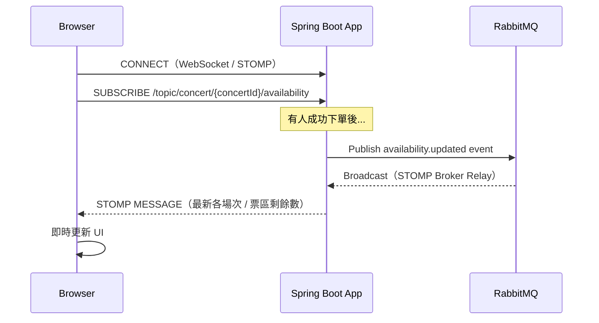
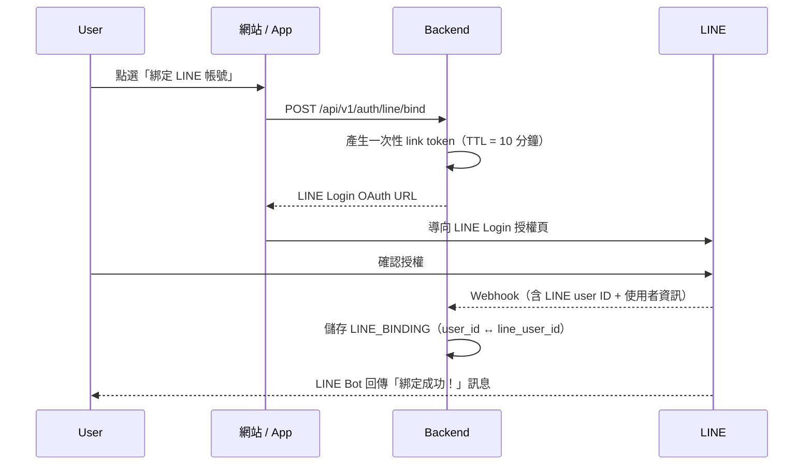

# 07 — 外部整合

> [← 返回總覽](../PROJECT_PLAN.md)

---

## 一、WebSocket 即時票況

### 功能說明

使用者進入演唱會詳情頁時，前端透過 WebSocket 訂閱該演唱會的即時票況頻道。  
當有人成功購票，後端廣播最新各場次 / 票區剩餘數量給所有在線使用者，頁面自動更新，不需手動刷新。

### 技術選型

- 後端：Spring WebSocket + STOMP Protocol
- 前端（Web）：`@stomp/stompjs` + `sockjs-client`（SockJS 作為 WebSocket fallback）
- 前端（Flutter）：`stomp_dart_client`

### 架構



### 單實例 vs 多實例

| 情境 | 做法 |
|---|---|
| **Phase 1（單一 App 實例）** | Spring WebSocket 直接廣播，不需要 RabbitMQ relay |
| **Phase 2+（多實例水平擴展）** | 開啟 RabbitMQ STOMP Broker Relay，RabbitMQ 負責跨 instance 廣播 |

Phase 2 切換時只需修改 Spring WebSocket 設定，開啟 External Broker，程式邏輯不變。

### STOMP Topic 設計

| Topic | 說明 |
|---|---|
| `/topic/concert/{concertId}/availability` | 該演唱會所有場次的剩餘票數更新 |

---

## 二、LINE Bot 整合

> ⚠️ **LINE Notify 已於 2025/03/31 正式停止服務，請勿使用。**  
> 所有通知功能改用 **LINE Messaging API**。

### 技術

- Java SDK：`com.linecorp.bot:line-bot-spring-boot`
- Webhook endpoint：`POST /api/v1/line/webhook`（LINE 平台將事件推送到此）

### 帳號綁定流程



### 綁定後可用功能

| 功能 | 說明 | 觸發時機 |
|---|---|---|
| 訂票確認 | Flex Message 卡片（演唱會名稱、場次、票區、金額）| 訂單建立成功 |
| 付款通知 | 付款成功或失敗的通知 | Payment Webhook 回調後 |
| 電子票券 | 推送票券 QR Code 圖片 | 付款成功後 |
| 開演提醒 | 開演前 24h / 2h 推送提醒 | Spring Batch ConcertReminderJob |
| 最新消息 | 後台人員發布的公告 | 後台手動發送 |
| 查詢票券 | 使用者在 LINE 輸入指令，Bot 回傳票券列表 | 使用者訊息 |

### Flex Message 範例（票券卡片）

使用 LINE Flex Message 呈現卡片式票券資訊，可包含：
- 演唱會封面圖
- 演唱會名稱、藝人
- 場次日期時間
- 票區、座位（對號入座）
- 訂單編號
- QR Code 圖片（靜態預覽，入場時以 App 動態版為準）

---

## 三、金流串接

### 整體架構

所有金流整合統一透過 `payment` module 的 `PaymentGateway` interface 處理，新增金流 provider 只需實作此 interface：

```java
public interface PaymentGateway {
    PaymentResult createPayment(PaymentRequest request);
    RefundResult refund(String gatewayTxId, int amount);
    boolean verifyWebhook(HttpServletRequest request);
}
```

### 綠界科技 ECPay（P1 — 台灣）

- 支援：信用卡、ATM 轉帳、超商代碼
- 電子發票：綠界提供獨立的電子發票 API，可一併串接
- 流程：
  1. 後端呼叫綠界 API 建立訂單，取得 HTML Form
  2. 前端提交 Form，用戶在綠界頁面完成付款
  3. 綠界 POST 回調到 `/api/v1/payments/webhook/ecpay`
  4. 後端驗證 CheckMacValue，更新訂單狀態

### 藍新金流 NewebPay（P1 — 台灣）

- 支援：信用卡、LINE Pay、街口支付
- 流程與綠界類似，參數格式不同

### Stripe（P2 — 全球）

- 支援：信用卡（全球）、Apple Pay、Google Pay
- 整合方式：Stripe Payment Intents API
- 前端使用 Stripe.js（Vue）/ flutter_stripe（Flutter）處理卡號輸入（PCI DSS 合規）
- Webhook 使用 `Stripe-Signature` Header 驗證來源

### 電子發票（台灣）

透過綠界 / 藍新的電子發票 API 串接，不需自行對接財政部：

| 載具類型 | 說明 |
|---|---|
| 手機條碼 | 用戶提供手機條碼（以 `/` 開頭的 8 碼）|
| 自然人憑證 | 提供憑證條碼 |
| 統一編號 | 公司行號抬頭，需填統編 |
| 無（存雲端）| 財政部雲端發票，用戶可至 app 查詢 |

---

## 四、HTML Email

### 技術

- 模板引擎：**Thymeleaf**（Spring Boot 內建支援）
- 傳送：JavaMailSender + **SendGrid** / AWS SES SMTP
- 模板位置：`src/main/resources/templates/mail/`

### Email 類型

| Email | 模板檔名 | 觸發時機 |
|---|---|---|
| 訂票確認 | `booking-confirmation.html` | 訂單建立成功 |
| 付款成功 | `payment-success.html` | Payment Webhook 確認付款 |
| 付款失敗 | `payment-failed.html` | Payment Webhook 確認失敗 |
| 退款通知 | `refund-notification.html` | 退款處理完成 |
| 開演提醒 | `concert-reminder.html` | Spring Batch 排程發送 |
| 帳號驗證 | `email-verification.html` | 註冊後要求驗證 Email（選配）|

### Thymeleaf 模板範例結構

```html
<!DOCTYPE html>
<html xmlns:th="http://www.thymeleaf.org">
<head>
  <meta charset="UTF-8">
  <title th:text="${subject}">訂票確認</title>
</head>
<body>
  <h1 th:text="${concertTitle}">演唱會名稱</h1>
  <p th:text="${'訂單編號：' + orderNo}">訂單編號</p>
  <!-- 可嵌入圖片（base64 或外部 CDN URL）-->
</body>
</html>
```

### 本機測試

本機開發使用 **Mailpit**（Docker Compose 內已包含）：
- SMTP：`localhost:1025`
- 收件匣：http://localhost:8025
- 所有 Email 都會被 Mailpit 攔截，不會真的寄出，可在 Web UI 查看效果

---

## 五、Firebase FCM（Flutter 推播通知）

- 用途：App 後台收到通知（開演提醒、訂票確認、最新消息）
- Flutter 套件：`firebase_messaging`
- 後端：透過 Firebase Admin SDK 或 HTTP API 發送

### 推播類型

| 類型 | 說明 |
|---|---|
| 訂票確認 | 付款成功後發送 |
| 開演前提醒 | Spring Batch 排程，開演前 24h / 2h |
| 最新消息 | 後台手動推播 |

> FCM Token 在 App 首次啟動時取得，需儲存到後端 USER 或獨立的 `device_token` 表，以便後端主動推播。
