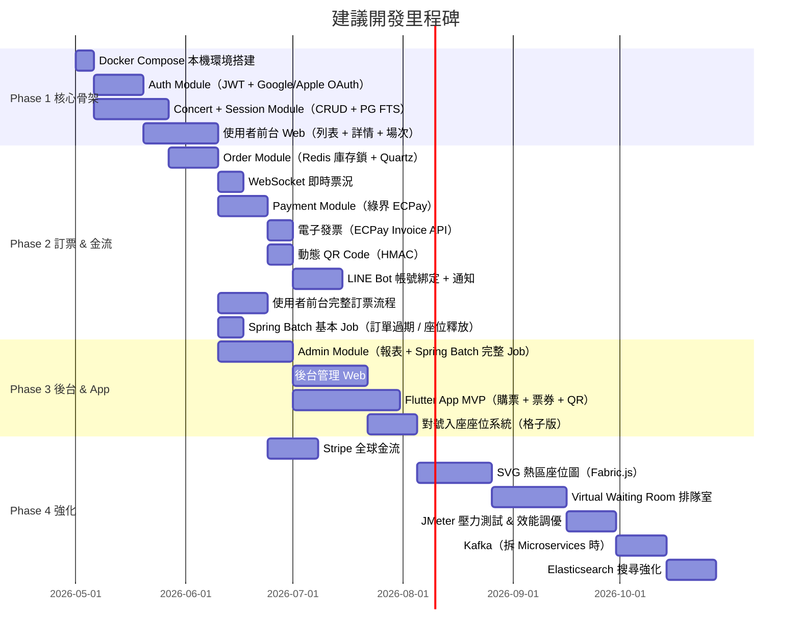
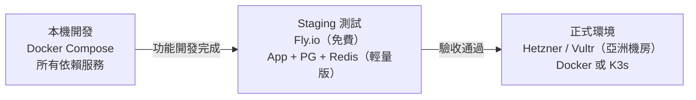

# 09 — 開發里程碑與部署策略

> [← 返回總覽](../PROJECT_PLAN.md)

---

## 開發里程碑

---

## Phase 說明

### Phase 1 — 核心骨架（目標：可以登入 + 瀏覽）

- 本機 Docker Compose 環境：PostgreSQL、Redis、RabbitMQ、MinIO、Nginx、Mailpit
- Auth module：Email 帳號系統、JWT、Google OAuth、Apple OAuth
- Concert module：演唱會 CRUD、場次管理、PostgreSQL 全文搜尋
- 使用者前台：列表頁、詳情頁、場次選擇、登入 / 註冊

完成標誌：使用者可以登入、瀏覽演唱會、看到場次資訊

---

### Phase 2 — 訂票 & 金流（目標：可以真的買票）

- Order module：Redis Lua 原子庫存扣減、訂單 10 分鐘鎖、Quartz Job
- WebSocket：即時票況廣播
- Payment module：綠界 ECPay 串接、電子發票
- 動態 QR Code：HMAC，每 60 秒刷新
- LINE Bot：帳號綁定、訂票 / 付款通知
- Spring Batch：`OrderExpiryJob`、`SeatLockReleaseJob`

完成標誌：使用者可以完成完整購票流程，收到 Email / LINE 確認，持 QR Code 可驗票

---

### Phase 3 — 後台 & App（目標：系統可以被管理）

- Admin module：統計、Spring Batch 全部 Job
- 後台管理 Web：演唱會管理、訂單管理、財報、驗票介面
- Flutter App：完整購票、動態 QR Code、Staff 驗票模式
- 對號入座：座位格子版

完成標誌：後台員工可以管理演唱會、查看報表；工作人員可以用 App 驗票

---

### Phase 4 — 強化（目標：全球可用、極高並發）

- Stripe 全球金流
- SVG 熱區座位圖
- Virtual Waiting Room（排隊室）
- JMeter 壓力測試（模擬萬人搶票）
- 效能調優（根據壓測結果）
- Kafka（視是否需要拆 Microservices）
- Elasticsearch（視搜尋需求）

---

## 部署策略

### 本機 Docker Compose 服務清單

| 服務 | Image | Port | 備註 |
|---|---|---|---|
| PostgreSQL | postgres:16 | 5432 | 主資料庫 |
| Redis | redis:7-alpine | 6379 | 快取 / 分散鎖 |
| RabbitMQ | rabbitmq:3-management | 5672 / 15672 | 訊息佇列（15672 為管理介面）|
| MinIO | minio/minio | 9000 / 9001 | 本機 S3（9001 為 Console）|
| Nginx | nginx:alpine | 80 | Reverse Proxy |
| Mailpit | axllent/mailpit | 1025 / 8025 | 本機 Email 測試（8025 為 Web UI）|
| Jaeger | jaegertracing/all-in-one | 16686 / 4317 | 分散式追蹤 |

> **Elasticsearch** 暫不加入，Phase 1~2 使用 PostgreSQL FTS。  
> **SonarQube** 使用獨立的 `docker-compose.sonarqube.yml`（較重，需時才啟動）。

### 正式環境建議規格

| 角色 | 規格 | 估算費用（Hetzner）|
|---|---|---|
| App Server（Spring Boot）| 2 vCPU / 4GB RAM | ~€5/月 |
| DB Server（PostgreSQL + Redis）| 2 vCPU / 8GB RAM | ~€8/月 |
| 初期合計 | | ~€13/月起 |

### Mac M4（ARM64）注意事項

- 本機 Docker：上述所有 image 均支援 `linux/arm64`，直接使用無問題
- 正式環境（x86_64）：Jenkins build 時加 `--platform linux/amd64` 或用 Docker Buildx 建 multi-arch image

---

## 尚未確認的待決事項

| 項目 | 現狀 | 建議 |
|---|---|---|
| 正式環境雲端平台 | 未定 | 建議 Hetzner（歐洲）或 Vultr（亞洲日本 / 新加坡機房）|
| SMS 通知服務商 | 未定 | Twilio（全球）或台灣在地業者 |
| 多幣別支援範圍 | 未定 | Stripe 支援，需確認 TWD / USD 等清單 |
| 票券轉讓防黃牛機制 | 未定 | 實名綁定 or 轉讓次數限制，待設計 |
| 特定演唱會實名制驗證 | 未定 | 是否需要身份證 / 護照驗證 |
| App Store / Play Store 上架 | 長期規劃 | Flutter App Phase 3 完成後處理 |
| 多租戶 SaaS 擴展 | 長期規劃 | 主辦方自助入口，Phase 5+ |
