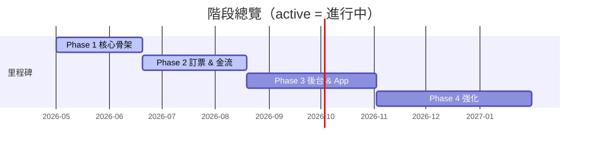
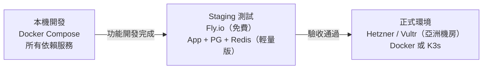

# 09 — 開發里程碑與部署策略

> [← 返回總覽](../PROJECT_PLAN.md)

---

## 目錄

1. [開發里程碑](#開發里程碑)
2. [Phase 說明](#phase-說明)
3. [部署策略](#部署策略)
4. [尚未確認的待決事項](#尚未確認的待決事項)

---

## 開發里程碑

```mermaid
gantt
    title 階段總覽（active = 進行中）
    dateFormat YYYY-MM-DD
    axisFormat %Y-%m
    section 里程碑
    Phase 1 核心骨架     :active, ph1, 2026-05-01, 50d
    Phase 2 訂票 & 金流  :active, ph2, after ph1, 60d
    Phase 3 後台 & App   :        ph3, after ph2, 75d
    Phase 4 強化         :        ph4, after ph3, 90d
```

> Phase 1 後端完成、前台主線進行中；Phase 2 後端 order 切片已完成，前台訂票 UI 與真實金流待接。
> 上圖為順序化概覽（實務上各 Phase 會部分並行）；各階段細項與狀態見下方各表。

---

## Phase 說明

### Phase 1 — 核心骨架（目標：可以登入 + 瀏覽）

| 任務 | 狀態 | 估時 |
|---|---|---|
| Docker Compose 本機環境（PG / Redis / RabbitMQ / MinIO / Nginx / Mailpit）| ✅ | 5d |
| Auth Module（Email 帳號、JWT；OAuth 延後至 Phase 2）| ✅ | 14d |
| Concert Module（演唱會 / 場次 CRUD、PG 全文搜尋）| ✅ | 21d |
| 使用者前台（列表 / 詳情 / 場次、登入 / 註冊）| 🚧 | 21d |

完成標誌：使用者可以登入、瀏覽演唱會、看到場次資訊

---

### Phase 2 — 訂票 & 金流（目標：可以真的買票）

| 任務 | 狀態 | 估時 |
|---|---|---|
| Order Module（Redis Lua 原子扣減、10 分鐘鎖、同步下單）| ✅ | 14d |
| Spring Batch（`OrderExpiryJob` 過期回補、`InventoryReconcileJob` 對帳）| ✅ | 7d |
| 使用者前台完整訂票流程（接後端切片）| ⏳ | 14d |
| WebSocket 即時票況廣播 | ⏳ | 7d |
| Payment Module（綠界 ECPay 串接）| ⏳ | 14d |
| 電子發票（ECPay Invoice API）| ⏳ | 7d |
| 動態 QR Code（HMAC，每 60 秒刷新）| ⏳ | 7d |
| LINE Bot（綁定 / 通知）、Google / Apple OAuth | ⏳ | 14d |

> order 後端切片含 sandbox 付款 + 出票（見 [docs/10](./10-order-design.md)）；真實金流與電子發票尚未串接。

完成標誌：使用者可以完成完整購票流程，收到 Email / LINE 確認，持 QR Code 可驗票

---

### Phase 3 — 後台 & App（目標：系統可以被管理）

| 任務 | 狀態 | 估時 |
|---|---|---|
| Admin Module（統計報表、Spring Batch 全部 Job）| ⏳ | 21d |
| 後台管理 Web（演唱會 / 訂單 / 財報 / 驗票）| ⏳ | 21d |
| Flutter App（購票、動態 QR、Staff 驗票）| ⏳ | 30d |
| 對號入座座位系統（格子版）| ⏳ | 14d |

完成標誌：後台員工可以管理演唱會、查看報表；工作人員可以用 App 驗票

---

### Phase 4 — 強化（目標：全球可用、極高並發）

| 任務 | 狀態 | 估時 |
|---|---|---|
| Stripe 全球金流 | ⏳ | 14d |
| SVG 熱區座位圖（Fabric.js）| ⏳ | 21d |
| Virtual Waiting Room 排隊室 | ⏳ | 21d |
| JMeter 壓力測試（模擬萬人搶票）+ 效能調優 | ⏳ | 28d |
| Kafka（視是否拆 Microservices）| ⏳ | 14d |
| Elasticsearch 搜尋強化 | ⏳ | 14d |

---

## 部署策略

```mermaid
graph LR
    Dev["本機開發\nDocker Compose\n所有依賴服務"]
    Staging["Staging 測試\nFly.io（免費）\nApp + PG + Redis（輕量版）"]
    Prod["正式環境\nHetzner / Vultr（亞洲機房）\nDocker 或 K3s"]

    Dev -->|"功能開發完成"| Staging
    Staging -->|"驗收通過"| Prod
```

### 本機 Docker Compose 服務清單

| 服務 | Image | Port | 備註 |
|---|---|---|---|
| PostgreSQL | postgres:16 | 5432 | 主資料庫 |
| Redis | redis:7-alpine | 6379 | 快取 / 分散鎖 |
| RabbitMQ | rabbitmq:3-management | 5672 / 15672 | 訊息佇列（15672 為管理介面）|
| MinIO | minio/minio | 9000 / 9001 | 本機 S3（9001 為 Console）|
| Nginx | nginx:alpine | 80 | Reverse Proxy |
| Mailpit | axllent/mailpit | 1025 / 8025 | 本機 Email 測試（8025 為 Web UI）|
| Jaeger | jaegertracing/all-in-one | 16686 / 4317 | 分散式追蹤 |

> **Elasticsearch** 暫不加入，Phase 1~2 使用 PostgreSQL FTS。  
> **SonarQube** 使用獨立的 `docker-compose.sonarqube.yml`（較重，需時才啟動）。

### 正式環境建議規格

| 角色 | 規格 | 估算費用（Hetzner）|
|---|---|---|
| App Server（Spring Boot）| 2 vCPU / 4GB RAM | ~€5/月 |
| DB Server（PostgreSQL + Redis）| 2 vCPU / 8GB RAM | ~€8/月 |
| 初期合計 | | ~€13/月起 |

### Mac M4（ARM64）注意事項

- 本機 Docker：上述所有 image 均支援 `linux/arm64`，直接使用無問題
- 正式環境（x86_64）：Jenkins build 時加 `--platform linux/amd64` 或用 Docker Buildx 建 multi-arch image

---

## 尚未確認的待決事項

| 項目 | 現狀 | 建議 |
|---|---|---|
| 正式環境雲端平台 | 未定 | 建議 Hetzner（歐洲）或 Vultr（亞洲日本 / 新加坡機房）|
| SMS 通知服務商 | 未定 | Twilio（全球）或台灣在地業者 |
| 多幣別支援範圍 | 未定 | Stripe 支援，需確認 TWD / USD 等清單 |
| 票券轉讓防黃牛機制 | 未定 | 實名綁定 or 轉讓次數限制，待設計 |
| 特定演唱會實名制驗證 | 未定 | 是否需要身份證 / 護照驗證 |
| App Store / Play Store 上架 | 長期規劃 | Flutter App Phase 3 完成後處理 |
| 多租戶 SaaS 擴展 | 長期規劃 | 主辦方自助入口，Phase 5+ |
