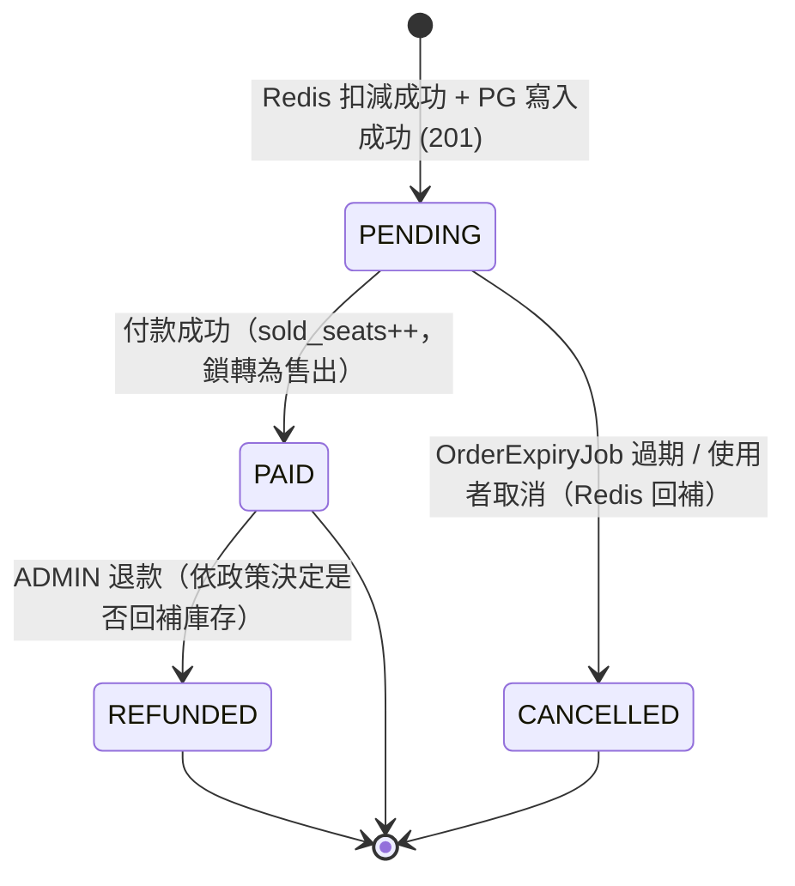

# 10 — Order 模組設計（庫存一致性與非同步可靠性）

> [← 返回總覽](../PROJECT_PLAN.md)
>
> - 對應 issue：P2-18（庫存雙重事實來源）、P2-19（非同步下單最終一致性）
> - 相關文件：[02 架構 §四 搶票核心](./02-architecture.md)、[03 資料模型](./03-data-model.md)、[08 排程任務](./08-batch-jobs.md)
> - 狀態：設計草案（2026-06-16）；實作待「最薄垂直切片」PoC
> - 決策依據：v1 台灣優先、單機誠實容量（見 `issue/PLANNING-DECISIONS.md` D1 / D3 / D4）

---

## 目錄

1. [目的與範圍](#一目的與範圍)
2. [核心決策摘要（先看這裡）](#二核心決策摘要先看這裡)
3. [庫存權威模型（P2-18）](#三庫存權威模型p2-18)
4. [下單落地策略（P2-19）](#四下單落地策略p2-19)
5. [對 NFR 與部署的依賴（D3 / D4）](#五對-nfr-與部署的依賴d3--d4)
6. [最薄垂直切片：實作待辦與驗收](#六最薄垂直切片實作待辦與驗收)
7. [對既有設計的影響（需同步修改）](#七對既有設計的影響需同步修改)

---

## 一、目的與範圍

本文件補上兩個在本輪 code-fix 被刻意延後的設計空白：

- **P2-18**：庫存同時被「Redis 即時扣減」與「PG `sold_seats`/`locked_seats` 欄位」描述，但沒有任何「誰是權威、如何對帳、如何復原」的規格。
- **P2-19**：架構圖只畫了「Redis 扣減成功 → 202 → RabbitMQ 非同步寫 DB」的 happy path，沒有任何失敗路徑（consumer 寫 DB 失敗、訊息遺失）的處理。

範圍：定義 **v1（台灣優先、單機）** 的 order 落地策略與其一致性/復原保證，並把「非同步削峰」明確定位為**未來演進**並先 spec 好，避免邊界未定時過度設計（D5）。本文件不含金流（payment）細節，只到「建立訂單、扣庫存、回報狀態」為止。

---

## 二、核心決策摘要（先看這裡）

| 主題 | v1 結論 | 理由 | 未來演進 |
|---|---|---|---|
| **庫存權威** | 售票期間「可售與否」唯一權威 = **Redis**；「已確定售出」唯一權威 = **PG `sold_seats` + orders**。 | 搶票要原子防超賣，只有 Redis 單點計數 + Lua 能做到；PG 負責最終帳本與可重建來源。 | 不變。 |
| **下單落地** | **同步**：Redis Lua 扣減 → 同步寫 PG（同一請求）→ **201 Created**。 | 最高風險是「防超賣」，與同步/非同步無關；非同步只是吞吐優化，卻引進整包最終一致性失敗面。單機下 PG 寫入非瓶頸（見 D4）。 | **Phase 4** 改 202 + RabbitMQ 削峰（§4-2 已 spec）。 |
| **Redis 可重建性** | Redis 視為 PG 的衍生快取，**永遠可由 PG 重算**。 | 同步落地下每張被接受的訂單都有 PG row，進行中鎖定量可由 PG 精確推導，復原無歧義。 | 非同步化後需額外處理 in-flight intent（§4-2）。 |
| **PG `locked_seats`** | 降為**觀測用快照**，由對帳/過期 job 刷新，**永不作為決策依據**。 | 消除「雙重事實來源」歧義：決策只看 Redis，PG 欄位只給報表/監控看。 | 不變。 |
| **訂單狀態機** | v1 維持現有 enum `PENDING / PAID / CANCELLED / REFUNDED`，**不需新增**。 | 同步落地下訂單「要嘛成功建立為 PENDING、要嘛根本沒建立」，不存在中間態。 | Phase 4 非同步需加 `PROCESSING` / `FAILED`（§4-2）。 |

> 這張表是本文件的「TL;DR」。下面各節是它的展開與理由。

---

## 三、庫存權威模型（P2-18）

### 3-1 權威來源定義

| 問題 | 權威來源 | 不可作為權威 |
|---|---|---|
| 「這個票區現在還能不能賣 / 還剩幾張」 | **Redis** `zone:remaining:{zoneId}` | PG（有延遲，且 locked 是 Redis 概念）|
| 「最終確定售出幾張（已付款）」 | **PG** `ticket_zone.sold_seats` + `order` / `ticket` | Redis（重啟可能遺失）|

**橋接不變式（任一時刻應成立）：**

```
Redis remaining  ==  total_seats(PG)  -  sold_seats(PG, 已付款)  -  進行中鎖定(PG PENDING 未過期)
```

### 3-2 Redis 資料結構

| Key | 型別 | 用途 |
|---|---|---|
| `zone:remaining:{zoneId}` | String(int) | 可售剩餘張數（Lua 原子增減）|
| `zone:ready:{zoneId}` | String("1") | 庫存就緒旗標；缺少時表示「未開賣 or 復原中」，下單一律拒絕 |
| `order:hold:{orderId}` | Hash, `EX 600` | 此訂單持有的鎖（zoneId, qty, userId）；TTL = 10 分鐘，與 `order.expires_at` 對齊 |

> 區域票（`has_assigned_seats = false`）只需 zone 計數。對號入座（座位級鎖定）為 Phase 2+，不在本切片。

### 3-3 扣減 / 回補（Lua，原子）

**扣減（下單）：**

```lua
-- KEYS[1] = zone:remaining:{zoneId}   KEYS[2] = zone:ready:{zoneId}
-- ARGV[1] = qty
if redis.call('EXISTS', KEYS[2]) == 0 then return -2 end          -- 未就緒 → 503
local remaining = tonumber(redis.call('GET', KEYS[1]) or '-1')
if remaining < 0 then return -2 end
if remaining < tonumber(ARGV[1]) then return -1 end               -- 不足 → 409 售罄
return redis.call('DECRBY', KEYS[1], ARGV[1])                     -- 成功，回傳扣後剩餘
```

回傳碼：`-2` = 復原中/未就緒（HTTP 503）、`-1` = 售罄（HTTP 409）、`>=0` = 成功。

**回補（訂單取消 / 過期 / 同步落地失敗補償）：** `INCRBY zone:remaining:{zoneId} qty`（同樣以 Lua 包裹，並由對帳 job 保證不超過 `total_seats`）。

### 3-4 冷啟動（票區開賣前 warm-up）

票區狀態轉 `ON_SALE` 時，由 warm-up 程序播種 Redis：

```
remaining = total_seats - sold_seats(PG)      -- 開賣前通常 sold=0、locked=0
SET zone:remaining:{zoneId} = remaining
SET zone:ready:{zoneId} = 1
```

### 3-5 故障復原（Redis 重啟 / 資料遺失）

Redis 設定 **AOF `appendfsync everysec`** 降低遺失窗口；但**設計上不依賴 Redis 持久化**——它永遠可由 PG 重算。復原程序（對每個 `ON_SALE` 票區）：

```
1. （ready 旗標已隨資料一起消失 → 此期間下單回 503，不會超賣）
2. paid        = sold_seats(PG, 已付款)
3. activeLocks = Σ order_item.quantity
                 WHERE order.status = PENDING AND order.expires_at > NOW()   -- 由 PG 精確推導
4. remaining   = total_seats - paid - activeLocks
5. SET zone:remaining = remaining
6. SET zone:ready = 1            -- 恢復售票
```

> **同步落地的關鍵優勢**：每張被接受的訂單都已寫入 PG，所以「進行中鎖定」可由 PG 精確推導，復原是**精確的、零歧義**。（Phase 4 非同步化後，in-flight 訂單可能尚未進 PG，復原需改為「短暫暫停售票 + 併查 Redis intent」，見 §4-2。）

### 3-6 對帳 job（`InventoryReconcileJob`）

定期（建議每 10 分鐘）對每個 `ON_SALE` 票區：

```
expected = total_seats - sold_seats(PG) - activeLocks(PG PENDING 未過期)
actual   = Redis remaining
drift    = actual - expected
```

- `drift == 0`：正常。
- `drift != 0`：寫 WARN log + 告警。在「無 in-flight 請求的安靜窗口」可自動校正（`SET remaining = expected`）。
- 順帶刷新 PG `ticket_zone.locked_seats = activeLocks`（純觀測快照）。

drift 主要來源：App 在「Redis 扣減成功」與「PG 寫入」之間 crash（§4-1 殘留邊界）；此 job 是其 self-healing 安全網。

### 3-7 PG `locked_seats` 欄位定位

明確降級為**觀測快照**：由 `InventoryReconcileJob` / `OrderExpiryJob` 刷新，僅供後台報表與監控顯示「目前鎖定中張數」，**任何售票決策都不得讀它**。這是消除 P2-18「雙重事實來源」的關鍵一刀。

---

## 四、下單落地策略（P2-19）

### 4-1 v1：同步落地（推薦）

```
POST /api/v1/orders   (JWT + 限流)
  1. 驗證：場次 ON_SALE、qty <= max_tickets_per_order、idempotency_key 未用過
  2. Redis EVAL 扣減 Lua（§3-3）
       -2 → 503（復原中）   -1 → 409（售罄）
  3. 成功：同一請求內同步寫 PG（同一交易）：
       order(status=PENDING, expires_at=now+10m, idempotency_key)
       + order_item
     並 SET order:hold:{orderId} EX 600
  4. 回 201 Created + 訂單（含 orderId、expires_at、待付款金額）
  5. 若步驟 3 PG 寫入失敗 → 立即補償 Redis（INCRBY 回補）→ 回 5xx
     （訂單根本未建立，使用者直接重試即可，無中間態）
```

**失敗路徑總表（v1）：**

| 失敗點 | 後果 | 處理 |
|---|---|---|
| Redis 扣減回 -1 / -2 | 未扣減 | 直接回 409 / 503，無副作用 |
| PG 寫入失敗（扣減已成功） | Redis 少算 | `catch` 內同步補償 INCRBY 回補 → 回 5xx |
| **App 在扣減後、PG 寫入前 crash** | Redis 少算且無補償 | **殘留邊界**：`order:hold` TTL 到期不會自動回補（無 PG row 觸發）→ 由 `InventoryReconcileJob`（§3-6）偵測 drift 並校正。窗口為單請求內數 ms，且 self-healing。 |
| 重複下單（idempotency_key 重送） | — | PG `idempotency_key` UK 擋下，回既有訂單 |
| 訂單 10 分鐘未付款 | 鎖定佔用 | `OrderExpiryJob`（5 分鐘）：PENDING 且過期 → CANCELLED → Redis INCRBY 回補 |

### 4-2 Phase 4：非同步落地（削峰）演進設計

當 JMeter 量測顯示 PG 同步寫入逼近單機上限時，才切換為非同步。屆時需補齊以下機制（**現在不實作，先 spec**）：

1. **可靠投遞**：開啟 RabbitMQ **publisher confirms**；扣減成功後先寫 `order:intent:{orderId}`（Redis，含 payload + TTL）再 publish，確保「已扣減的訂單」有跡可循。回 **202 Accepted + orderId（狀態 PROCESSING）**。
2. **idempotent consumer**：以 `idempotency_key`（ORDER UK）去重；orderId 在 202 時已產生並穩定，重複投遞為 no-op。
3. **DLQ + 重試**：consumer 失敗重試 N 次後進 dead-letter queue → 告警 + 觸發補償。
4. **訊息遺失補洞**：`PendingOrderSweeperJob` 掃描 `order:intent` 存在但 PG 無對應訂單且超時者 → 重投或直接補寫。
5. **補償**：DB 最終寫入失敗（DLQ）→ 回補 Redis 庫存 + 訂單標記 `FAILED` + 通知使用者。
6. **狀態機擴充**：新增 `PROCESSING`（202 後寫入中）與 `FAILED`（寫入最終失敗）。
7. **使用者可見回報**：202 後前端輪詢 `GET /api/v1/orders/{orderId}` 或 WebSocket；查詢需在 PG row 出現前先讀 `order:intent` 回 `PROCESSING`，避免剛接受的訂單查到 404。

### 4-3 訂單狀態機（v1）



> v1 無 `PROCESSING` / `FAILED`：同步落地下訂單「要嘛建立成功為 PENDING、要嘛根本沒建立」。這兩個狀態是 Phase 4 非同步化才需要。

### 4-4 使用者可見狀態回報（v1）

同步落地下，`POST /orders` **同步回 201 + 完整訂單**，前端拿到後直接進付款頁，**無需輪詢**。付款結果則走既有 payment callback / `GET /orders/{orderId}` 查詢。（非同步化後才需要 §4-2 的 PROCESSING 輪詢。）

---

## 五、對 NFR 與部署的依賴（D3 / D4）

本設計以「單機誠實容量」為前提。對應決策已記入 `issue/PLANNING-DECISIONS.md`：

- **D3 部署拓樸**：v1 單機（App 2vCPU/4GB + DB 2vCPU/8GB），不宣稱「萬人搶票」。程式碼保持**水平就緒**（stateless app、Redis 為共享庫存狀態、Quartz 叢集排程），水平擴展（多 App + LB、PG read replica、Redis 哨兵/HA）延後 Phase 4，觸發條件 = JMeter 量測逼近單機上限。
- **D4 NFR（建議初始值，待壓測修正）**：尖峰同時在線 ~1,000；下單建立 持續 50 TPS / 突發 100 TPS；API P99 讀取 < 200ms、下單 < 300ms；可用性 99.5%；**超賣率 0（硬性正確性，非效能指標）**。

---

## 六、最薄垂直切片：實作待辦與驗收

目標：用最小範圍，**真正驗證最高風險（併發不超賣 + Redis 故障可復原）**。

### 6-1 範圍

- **In**：單一 `ON_SALE` 場次、區域票（無對號入座）、單票區單品項、同步下單、Redis Lua 扣減、warm-up、`OrderExpiryJob`、`InventoryReconcileJob`、付款 sandbox（綠界測試或先以 mock）→ 出票。
- **Out**：對號入座、多票區/多品項一單、非同步削峰、WebSocket 即時票況、電子發票、LINE 通知、排隊室。

### 6-2 實作待辦（checklist）

- [ ] `order` 模組骨架（api / application / domain / infrastructure，schema `order`），遵循 [02 §五 註解規範](./02-architecture.md)
- [ ] Flyway migration：`order`、`order_item`、`ticket` 表（對齊 [03 資料模型](./03-data-model.md)）
- [ ] Redis Lua 扣減 / 回補 script + `InventoryPort`（domain）+ Redis adapter（infra）
- [ ] 票區開賣 warm-up（concert 票區轉 `ON_SALE` 時播種 Redis）
- [ ] `OrderService.createOrder()`：驗證 → 扣減 → 同步寫 PG → 201；失敗補償
- [ ] `idempotency_key` UK 與重送處理
- [ ] `OrderExpiryJob`（5 分鐘）+ `InventoryReconcileJob`（10 分鐘）
- [ ] Redis 復原程序（§3-5）+ `zone:ready` 旗標守門
- [ ] 付款 sandbox 串接（或 mock）→ 成功則 `sold_seats++`、出 `ticket`

### 6-3 驗收標準

- [ ] **併發不超賣**：對單一票區（如 total=100）以遠超庫存的併發請求（如 500 並發）下單，**成功訂單數 == 100，零超賣**（整合測試，Testcontainers + 真實 Redis）。
- [ ] **過期回補**：未付款訂單於 `expires_at` 後被 `OrderExpiryJob` 取消，Redis 剩餘正確回補。
- [ ] **Redis 重啟可復原**：清空 / 重啟 Redis 後執行復原程序，`zone:remaining` 與 PG 推導值一致，且復原期間下單回 503 不超賣。
- [ ] **對帳**：人為製造 drift（直接改 Redis）後，`InventoryReconcileJob` 偵測並（安靜窗口）校正。
- [ ] **idempotency**：相同 `idempotency_key` 重送只建立一張訂單。

---

## 七、對既有設計的影響（需同步修改）

| 文件 / 物件 | 變更 |
|---|---|
| `docs/03-data-model.md` `ticket_zone.locked_seats` | 註明「觀測快照，非權威，售票決策不得讀取」（§3-7）|
| `docs/08-batch-jobs.md` | 新增 `InventoryReconcileJob`；`OrderExpiryJob` 補述 Redis 回補與本文件連結 |
| `docs/02-architecture.md` §四 | 補一行連結指向本文件（搶票核心細節以本文件為準）|
| `order.status` enum | v1 不變；`PROCESSING` / `FAILED` 留待 Phase 4 非同步化再加 |
| Redis 設定 | 啟用 AOF `appendfsync everysec`（§3-5）|
